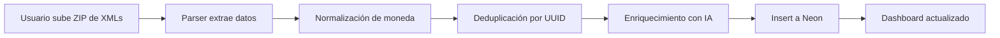

# 📄 Módulo CFDI Parser → Neon PostgreSQL

## 🎯 Objetivo

Parsear XMLs de CFDI 4.0 (facturas electrónicas mexicanas) y almacenarlos en base de datos Neon PostgreSQL para:
- Eliminar fricción de setup (upload XML una vez, dashboard para siempre)
- Garantizar precisión fiscal (datos oficiales del SAT)
- Permitir históricos ilimitados (XMLs desde 2014 disponibles)
- Construir benchmarks sectoriales con datos agregados

---

## 📁 Estructura del Módulo

```
cfdi/
├── __init__.py              # Módulo principal
├── parser.py                # Parser de CFDI 4.0 y complementos
├── neon_schema.sql          # Schema de base de datos
├── ingestion.py             # (TODO) Lógica de ingesta a Neon
├── enrichment.py            # (TODO) Enriquecimiento con IA
└── README.md                # Esta documentación
```

---

## 🚀 Quick Start

### 1. Instalar dependencias

```bash
pip install lxml psycopg2-binary python-dotenv
```

### 2. Configurar Neon Database

```bash
# Crear cuenta en https://neon.tech
# Crear proyecto y base de datos

# Ejecutar schema
psql $DATABASE_URL -f cfdi/neon_schema.sql
```

### 3. Parsear un CFDI de ejemplo

```python
from cfdi.parser import CFDIParser

parser = CFDIParser()
datos = parser.parse_cfdi_venta('path/to/factura.xml')

print(f"UUID: {datos['timbre']['uuid']}")
print(f"Cliente: {datos['receptor']['nombre']}")
print(f"Total: ${datos['total']:.2f} {datos['moneda']}")
```

### 4. Procesar batch de XMLs

```python
from cfdi.parser import parse_cfdi_batch

resultados = parse_cfdi_batch(
    xml_files=['factura1.xml', 'factura2.xml', ...],
    empresa_id='uuid-de-empresa'
)

print(f"✅ {len(resultados['ventas'])} facturas procesadas")
print(f"✅ {len(resultados['pagos'])} pagos documentados")
print(f"❌ {len(resultados['errores'])} errores")
```

---

## 📊 Schema de Base de Datos

### Tablas principales:

| Tabla | Descripción | Registros esperados |
|-------|-------------|-------------------|
| `empresas` | Clientes de Fradma | 100-1000 |
| `cfdi_ventas` | Facturas emitidas | 500K-5M |
| `cfdi_conceptos` | Líneas de productos | 2M-20M |
| `cfdi_pagos` | Complementos de pago | 200K-2M |
| `clientes_master` | Catálogo de end-customers | 10K-100K |
| `benchmarks_industria` | Métricas agregadas | 1K-10K |

### Vistas útiles:

- `v_cartera_clientes` - CxC por cliente con días de crédito
- `v_ventas_linea_mes` - Ventas por línea de negocio y mes

---

## 🔄 Flujo de Ingesta



### Detalles técnicos:

1. **Upload:** Usuario sube ZIP con 100-5000 XMLs
2. **Validación:** Verificar estructura CFDI 4.0 válida
3. **Parsing:** Extraer datos con `CFDIParser` y `ComplementoPagoParser`
4. **Normalización:** 
   - Convertir monedas a MXN usando tipo de cambio oficial
   - Estandarizar nombres de clientes (similar strings)
5. **Deduplicación:** Verificar UUID no exista ya
6. **Enriquecimiento:**
   - Clasificar línea de negocio con GPT-4 fine-tuned
   - Detectar patrones de estacionalidad
7. **Insert:** Transacción batch a Neon
8. **Post-procesamiento:** Actualizar métricas agregadas

---

## 🤖 Enriquecimiento con IA

### Clasificación de línea de negocio

```python
# Ejemplo: descripción del concepto → línea de negocio
"Tornillo hexagonal 1/4 x 2" acero grado 8"
    ↓ GPT-4 fine-tuned
"ferreteria_industrial"

"Bomba sumergible 1.5HP marca Franklin"
    ↓
"equipos_hidraulicos"
```

**Prompt usado:**
```
Clasifica el siguiente producto en una de estas categorías:
- ferreteria_herramientas
- ferreteria_industrial
- equipos_hidraulicos
- materiales_construccion
- plasticos_industriales
- otro

Producto: {descripcion}
Categoría:
```

### Detección de anomalías

```python
# Cliente normalmente compra $10K-15K mensual
# Este mes: $45K → Alerta: "Compra inusual, verificar si aplica crédito"
```

---

## 📈 Ventajas vs Excel Upload

| Aspecto | Excel Manual | XML CFDI |
|---------|-------------|----------|
| **Setup time** | 5-10 min | 2 min |
| **Precisión** | 90-95% (errores humanos) | 100% (datos SAT) |
| **Histórico** | Lo que exportes | Ilimitado (2014+) |
| **Actualización** | Manual cada vez | 1 vez, luego automático |
| **Validación fiscal** | No | Sí (UUID oficial) |
| **Benchmarks** | No disponible | Sí (con N ≥50 clientes) |

---

## 🔐 Seguridad y Privacidad

### Datos sensibles:
- XMLs contienen datos fiscales reales (RFC, razones sociales, montos)
- **Nunca** compartir XML completo entre clientes
- Anonimizar para benchmarks (solo agregados, sin identificadores)

### Medidas implementadas:
```sql
-- Benchmarks: sin identificadores de empresa
SELECT 
    industria,
    AVG(dias_credito) as dso_promedio,
    COUNT(DISTINCT empresa_id) as n_empresas  -- Mínimo 30
FROM cfdi_ventas
GROUP BY industria
HAVING COUNT(DISTINCT empresa_id) >= 30;  -- K-anonymity
```

---

## 🚧 Roadmap

### Fase 1: MVP (Semanas 1-4) ✅
- [x] Parser CFDI 4.0 básico
- [x] Schema Neon PostgreSQL
- [ ] Script de ingesta manual
- [ ] Tests unitarios del parser

### Fase 2: Automatización (Semanas 5-8)
- [ ] Upload ZIP desde Streamlit UI
- [ ] Progress bar durante ingesta
- [ ] Enriquecimiento con GPT-4
- [ ] Dashboard conectado a Neon

### Fase 3: Integración PAC (Semanas 9-16)
- [ ] API connector Finkok
- [ ] API connector SW Sapien
- [ ] Sync automático diario
- [ ] Webhook para CFDIs nuevos

### Fase 4: Inteligencia (Semanas 17-24)
- [ ] Benchmarks sectoriales (N≥50)
- [ ] Alertas predictivas
- [ ] Fine-tuning GPT-4 en descripciones MX
- [ ] Sugerencias de cobranza basadas en patterns

---

## 📞 Soporte

**Responsable:** @B10sp4rt4n  
**Última actualización:** 26 febrero 2026  
**Versión:** 0.1.0
