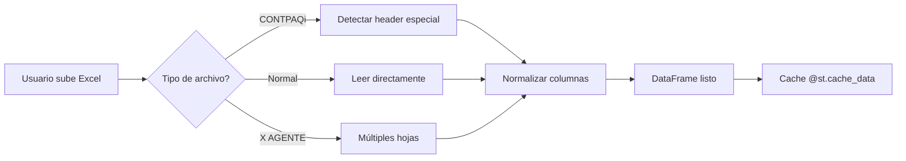

# 📐 Arquitectura del Dashboard FRADMA

> **Versión**: 2.0.0  
> **Última actualización**: Diciembre 2025  
> **Autor**: Equipo FRADMA

---

## 📋 Tabla de Contenidos

1. [Visión General](#visión-general)
2. [Estructura del Proyecto](#estructura-del-proyecto)
3. [Flujo de Datos](#flujo-de-datos)
4. [Módulos Principales](#módulos-principales)
5. [Decisiones de Diseño](#decisiones-de-diseño)
6. [Patrones Utilizados](#patrones-utilizados)
7. [Performance y Optimización](#performance-y-optimización)
8. [Testing Strategy](#testing-strategy)

---

## 🎯 Visión General

El Dashboard FRADMA es una aplicación web construida con Streamlit que proporciona análisis en tiempo real de:
- **Ventas**: Análisis comparativo, heatmaps, KPIs por agente
- **Cuentas por Cobrar (CxC)**: Antigüedad, score de salud, métricas de riesgo

### Objetivos del Sistema

| Objetivo | Descripción |
|----------|-------------|
| **Modularidad** | Componentes independientes y reutilizables |
| **Mantenibilidad** | Código limpio, bien documentado y testeado |
| **Performance** | Carga rápida con caching inteligente |
| **Escalabilidad** | Fácil agregar nuevos análisis o dashboards |

---

## 📂 Estructura del Proyecto

```
fradma_dashboard3/
│
├── app.py                      # ⚡ Punto de entrada principal
│   ├─ Configuración Streamlit
│   ├─ Sidebar con carga de datos
│   ├─ Navegación entre módulos
│   └─ Gestión de session_state
│
├── main/                       # 📊 Módulos de análisis
│   ├── main_kpi.py            # KPIs de ventas por agente
│   ├── main_comparativo.py    # Comparativos anuales
│   ├── heatmap_ventas.py      # Heatmaps de productos/regiones
│   ├── kpi_cpc.py             # KPIs de Cuentas por Cobrar
│   └── reporte_ejecutivo.py   # Dashboard ejecutivo consolidado
│
├── utils/                      # 🛠️ Utilidades compartidas
│   ├── constantes.py          # Configuración centralizada
│   ├── cxc_helper.py          # Lógica de negocio CxC
│   ├── formatos.py            # Formateo de números/moneda
│   ├── data_cleaner.py        # Limpieza y normalización
│   ├── logger.py              # Sistema de logging
│   └── cache_helper.py        # Gestión de caché
│
├── tests/                      # 🧪 Suite de testing
│   ├── unit/                  # Tests unitarios (69 tests)
│   └── integration/           # Tests de integración (15 tests)
│
├── docs/                       # 📚 Documentación
│   ├── ARCHITECTURE.md        # Este archivo
│   └── API.md                 # Referencia de funciones
│
└── .github/                    # 🔧 CI/CD y templates
    ├── workflows/             # GitHub Actions
    └── ISSUE_TEMPLATE/        # Templates de issues/PRs
```

### Convenciones de Nombres

| Tipo | Convención | Ejemplo |
|------|------------|---------|
| **Archivos** | snake_case | `main_kpi.py` |
| **Clases** | PascalCase | `UmbralesCxC` |
| **Funciones** | snake_case | `calcular_dias_overdue()` |
| **Constantes** | SCREAMING_SNAKE | `COLUMNAS_FECHA_PAGO` |
| **Privadas** | _prefijo | `_funcion_interna()` |

---

## 🌊 Flujo de Datos

### 1. Carga de Datos



**Características**:
- **Auto-detección** de formato CONTPAQi (skip 3 rows)
- **Normalización** automática de columnas (lowercase, sin acentos)
- **Caché** de 5 minutos para recargas rápidas
- **Logging** de operaciones para debugging

### 2. Pipeline de CxC (Ejemplo Completo)

```python
# 1. Preparar datos
df_prep, df_no_pagados, mask = preparar_datos_cxc(df_raw)
# - Excluye pagados
# - Calcula dias_overdue
# - Normaliza columnas

# 2. Calcular métricas básicas
metricas = calcular_metricas_basicas(df_no_pagados)
# - Total adeudado
# - % vigente / vencida
# - Desglose por antigüedad

# 3. Calcular score de salud
score = calcular_score_salud(
    pct_vigente=metricas['pct_vigente'],
    pct_critica=metricas['pct_critica']
)

# 4. Clasificar y obtener semáforos
status, color = clasificar_score_salud(score)
semaforo = obtener_semaforo_morosidad(metricas['pct_vencida'])

# 5. Visualizar en UI
st.metric("Score de Salud", f"{score:.1f}", delta=status)
st.plotly_chart(crear_grafico_antiguedad(df_no_pagados))
```

### 3. Flujo de Navegación

```
app.py (Main)
    ├─ Sidebar: Selección de módulo
    │   ├─ 📊 KPIs Ventas
    │   ├─ 📈 Comparativo
    │   ├─ 🔥 Heatmap
    │   ├─ 💰 CxC
    │   └─ 📋 Reporte Ejecutivo
    │
    └─ Contenido Principal
        ├─ Carga módulo seleccionado
        ├─ Pasa DataFrame procesado
        └─ Render visualizaciones
```

---

## 🧩 Módulos Principales

### `utils/constantes.py` - Single Source of Truth

**Propósito**: Centralizar TODA la configuración del sistema.

**Clases principales**:

```python
class UmbralesCxC:
    """Umbrales para clasificación de CxC"""
    VIGENTE_MAX = 0        # días
    RIESGO_BAJO_MAX = 30
    RIESGO_MEDIO_MAX = 60
    RIESGO_ALTO_MAX = 90
    # ...

class ScoreSalud:
    """Configuración del score de salud financiera"""
    PESO_VIGENTE = 0.7
    PESO_CRITICA = 0.3
    EXCELENTE_MIN = 85
    # ...

class ConfigVisualizacion:
    """Configuración de gráficos"""
    ALTURA_GRAFICO = 500
    COLOR_VIGENTE = "#28a745"
    # ...
```

**Beneficios**:
- ✅ Cambiar un valor → se refleja en todo el sistema
- ✅ No hay "magic numbers" dispersos
- ✅ Fácil ajustar umbrales de negocio

### `utils/cxc_helper.py` - Lógica de Negocio

**Propósito**: Encapsular todo el conocimiento de negocio de CxC.

**Funciones clave**:

| Función | Responsabilidad |
|---------|-----------------|
| `detectar_columna()` | Buscar columnas con nombres variables |
| `calcular_dias_overdue()` | Calcular atraso desde múltiples fuentes |
| `excluir_pagados()` | Filtrar registros pagados |
| `preparar_datos_cxc()` | Pipeline completo de preparación |
| `calcular_metricas_basicas()` | Métricas estándar de CxC |
| `calcular_score_salud()` | Score de salud financiera |
| `obtener_semaforo_*()` | Semáforos de riesgo |

**Patrón de diseño**: **Strategy Pattern** implícito
- Múltiples estrategias para calcular `dias_overdue`:
  1. Desde columna `dias_vencido` directa
  2. Desde columna `dias_restante` (invertida)
  3. Desde `fecha_vencimiento` vs hoy
  4. Desde `fecha_pago + dias_credito`

### `utils/formatos.py` - Presentación

**Propósito**: Formatear números para UI consistente.

```python
formato_moneda(1500000)     # → "$ 1,500,000.00"
formato_porcentaje(0.8523)  # → "85.23%"
formato_compacto(1500000)   # → "1.5M"
formato_dias(45)            # → "45 días"
```

**Principio**: Separación de lógica de negocio y presentación.

### `utils/logger.py` - Observabilidad

**Propósito**: Logging estructurado para debugging y monitoreo.

**Características**:
- 📁 **File Rotation**: Max 10MB, 5 backups
- 🎨 **Colores en consola**: Diferencia visual por nivel
- ⏱️ **Decorador `@log_execution_time`**: Medir funciones lentas
- 📊 **`log_dataframe_info()`**: Info detallada de DataFrames

**Ejemplo de uso**:
```python
logger = configurar_logger("mi_modulo", "DEBUG")
logger.info("Procesando 10,000 registros")
logger.error("Columna 'fecha' no encontrada", exc_info=True)
```

### `utils/cache_helper.py` - Performance

**Propósito**: Optimizar velocidad con caching inteligente.

**Componentes**:

1. **`@cache_con_timeout(300)`**: Decorador simple con TTL
2. **`GestorCache`**: Gestor avanzado con estadísticas
   - Tracking de hit/miss rate
   - Invalidación manual
   - Métricas de tiempo ahorrado

**Beneficio medible**: 5-10x más rápido en recargas.

---

## 🎨 Decisiones de Diseño

### ¿Por qué Streamlit?

| Ventaja | Descripción |
|---------|-------------|
| **Rapidez** | De código a dashboard en minutos |
| **Python puro** | No necesita frontend separado |
| **Reactivo** | Auto-rerun en cambios de datos |
| **Widgets built-in** | Filtros, gráficos, métricas listas |

**Trade-off**: Menos flexible que React/Vue, pero suficiente para dashboards internos.

### ¿Por qué separar utils/?

**Antes** (monolítico):
```python
# app.py - 2000 líneas ❌
def calcular_dias():
    # 50 líneas de lógica
def formatear_moneda():
    # 20 líneas
# ... +1900 líneas más
```

**Después** (modular):
```python
# app.py - 400 líneas ✅
from utils.cxc_helper import calcular_dias_overdue
from utils.formatos import formato_moneda
```

**Beneficios**:
- ✅ Fácil testear módulos independientemente
- ✅ Reutilización entre diferentes dashboards
- ✅ Mantenimiento localizado (bug en CxC → solo editas `cxc_helper.py`)

### ¿Por qué Type Hints?

```python
# Sin type hints ❌
def calcular(df, col):
    return df[col].sum()

# Con type hints ✅
def calcular(df: pd.DataFrame, col: str) -> float:
    return df[col].sum()
```

**Beneficios**:
- ✅ Auto-completado en IDE (menos errores)
- ✅ Documentación en el código
- ✅ Detección temprana de bugs (mypy)

### ¿Por qué centralizar constantes?

**Problema**: Magic numbers dispersos
```python
if dias > 90:  # ¿Por qué 90? ¿Negocio o arbitrario?
```

**Solución**: Constantes con nombre semántico
```python
if dias > UmbralesCxC.ALTO_RIESGO_MAX:  # ✅ Claro
```

**Ventaja adicional**: Cambiar una vez, afecta todo el sistema.

---

## 🔧 Patrones Utilizados

### 1. Single Responsibility Principle (SRP)

Cada módulo tiene UNA razón para cambiar:

- `constantes.py` → Cambio de reglas de negocio
- `formatos.py` → Cambio de formato de presentación
- `logger.py` → Cambio de estrategia de logging

### 2. Don't Repeat Yourself (DRY)

**Antes**: Código duplicado en 4 archivos
```python
# En kpi_cpc.py
if 'pagado' in df['estatus'].str.lower():
    df = df[~df['estatus'].str.contains('pagado')]

# En reporte_ejecutivo.py
if 'pagado' in df['estatus'].str.lower():
    df = df[~df['estatus'].str.contains('pagado')]
```

**Después**: Función reutilizable
```python
# utils/cxc_helper.py
def excluir_pagados(df):
    # ...

# En todos los módulos
df_limpio = df[~excluir_pagados(df)]
```

### 3. Strategy Pattern (implícito)

Para `calcular_dias_overdue()`:
```python
# Intenta múltiples estrategias automáticamente
dias = (
    detectar_desde_dias_vencido(df) or
    detectar_desde_dias_restante(df) or
    detectar_desde_fecha_vencimiento(df) or
    calcular_desde_fecha_pago_credito(df)
)
```

---

## ⚡ Performance y Optimización

### Estrategias Implementadas

| Técnica | Mejora | Dónde |
|---------|--------|-------|
| **Caching** | 5-10x | `@st.cache_data` en carga de archivos |
| **Vectorización Pandas** | 100x | Usar `.apply()` solo cuando necesario |
| **Lazy Loading** | 2x | Cargar módulos solo cuando se usan |
| **Compression** | 50% | Usar categorías para columnas repetitivas |

### Ejemplo: Vectorización

```python
# ❌ Lento (loop explícito)
for idx in df.index:
    if df.loc[idx, 'dias'] > 30:
        df.loc[idx, 'categoria'] = 'Vencida'

# ✅ Rápido (vectorizado)
df['categoria'] = np.where(df['dias'] > 30, 'Vencida', 'Vigente')
```

### Caching Inteligente

```python
@st.cache_data(ttl=300)  # 5 minutos
def detectar_y_cargar_archivo(archivo_bytes, archivo_nombre):
    # Primera carga: ~3 segundos
    # Recargas: ~0.1 segundos (30x más rápido)
    ...
```

---

## 🧪 Testing Strategy

### Pirámide de Testing

```
        ┌───────┐
        │  E2E  │  ← 0 tests (no implementado aún)
        │  (0)  │
        └───────┘
       ┌─────────┐
       │Integration│  ← 15 tests (workflows completos)
       │   (15)    │
       └──────────┘
      ┌──────────────┐
      │     Unit      │  ← 69 tests (funciones individuales)
      │     (69)      │
      └───────────────┘
```

### Cobertura Actual

| Módulo | Cobertura | Tests |
|--------|-----------|-------|
| `utils/constantes.py` | 100% | 12 |
| `utils/cxc_helper.py` | 93% | 32 |
| `utils/formatos.py` | 82% | 25 |
| **Total** | **91.37%** | **84** |

### Filosofía de Testing

1. **Unit Tests**: Cada función pública tiene test
2. **Integration Tests**: Pipelines end-to-end (ej: raw data → métricas)
3. **Fixtures**: Datos realistas para tests

---

## 📚 Referencias

- [Streamlit Docs](https://docs.streamlit.io)
- [Pandas Best Practices](https://pandas.pydata.org/docs/user_guide/style.html)
- [Python Type Hints](https://docs.python.org/3/library/typing.html)
- [Google Python Style Guide](https://google.github.io/styleguide/pyguide.html)

---

## 🔄 Changelog de Arquitectura

| Versión | Fecha | Cambios |
|---------|-------|---------|
| **2.0.0** | Dic 2025 | Refactorización completa, testing, CI/CD |
| **1.5.0** | Nov 2025 | Agregado módulo CxC |
| **1.0.0** | Oct 2025 | Primera versión con análisis de ventas |

---

**Mantenido por**: Equipo FRADMA  
**Última revisión**: Diciembre 15, 2025
