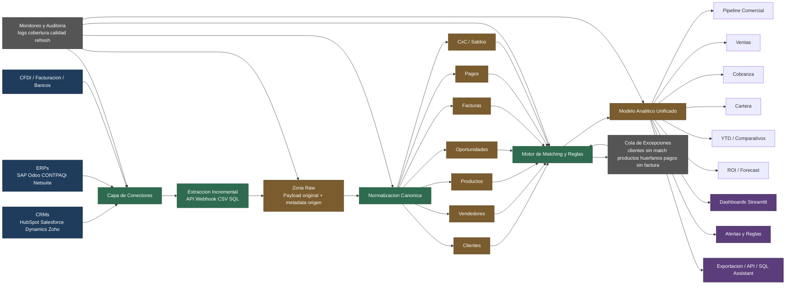

# Arquitectura de Integracion CRM ERP

## Objetivo

Definir una arquitectura robusta para jalar datos desde CRMs, ERPs y fuentes financieras hacia una capa analitica comun, evitando conectar el dashboard directamente a cada sistema origen.

La idea central es separar:

1. Extraccion
2. Persistencia raw
3. Normalizacion canonica
4. Matching y reglas de conciliacion
5. Modelo analitico final
6. Consumo en dashboards, alertas y exportaciones

## Diagrama General

## Vista SVG Renderizada

## Archivos Exportados

- SVG: `docs/assets/diagrams/arquitectura_integracion_crm_erp.svg`
- PNG: `docs/assets/diagrams/arquitectura_integracion_crm_erp.png`

## Lectura Ejecutiva

### 1. Capa de Conectores

Aqui viven los adaptadores por sistema fuente.

- CRM: HubSpot, Salesforce, Dynamics, Zoho
- ERP: SAP, Odoo, CONTPAQi, Netsuite
- Otras fuentes: CFDI, bancos, archivos CSV, webhooks

Su responsabilidad debe ser solo leer y entregar datos, no transformar logica de negocio.

### 2. Extraccion Incremental

La extraccion debe ser incremental siempre que el sistema origen lo permita.

Ejemplos:

- por `updated_at`
- por folio o consecutivo
- por ventana de fechas
- por eventos o webhooks

Esto reduce costo, tiempo y riesgo de duplicados.

### 3. Zona Raw

La zona raw guarda el payload original con metadata de trazabilidad.

Campos recomendados:

- sistema_origen
- entidad_origen
- id_origen
- payload_json
- fecha_extraccion
- hash_registro
- estado_proceso

Esta capa sirve para auditoria, replay y debugging.

### 4. Normalizacion Canonica

Aqui se convierten estructuras heterogeneas a entidades comunes del negocio.

Entidades minimas sugeridas:

- clientes
- vendedores
- productos
- oportunidades
- facturas
- pagos
- saldos / cartera

La normalizacion debe resolver nombres de columnas, formatos, monedas, fechas y catalogos.

### 5. Motor de Matching y Reglas

Esta es la capa mas importante. Aqui se concilian registros entre sistemas.

Casos tipicos:

- mismo cliente con razon social distinta
- factura del ERP ligada a oportunidad del CRM
- pago bancario ligado a factura
- vendedor del CRM reconciliado con vendedor del ERP
- producto local mapeado a producto corporativo

Reglas recomendadas:

1. matching exacto por identificador duro cuando exista
2. matching por RFC o tax ID
3. matching por nombre normalizado
4. matching asistido con reglas de negocio o revision humana

### 6. Modelo Analitico Unificado

Una vez conciliados los datos, se publica un modelo analitico estable para consumo.

Sujetos analiticos recomendados:

- pipeline comercial
- ventas netas
- cobranza
- cuentas por cobrar
- comparativos YTD
- proyecciones y forecast
- ROI comercial

Este modelo debe ser el unico punto que consumen dashboards y analistas.

### 7. Consumo

Desde el modelo analitico unificado salen:

- dashboards en Streamlit
- alertas operativas
- exportaciones a Excel o CSV
- capa SQL o asistente analitico
- APIs internas para otras apps

## Por Que No Conectar Directo el Dashboard al CRM o ERP

Porque eso degrada el producto rapidamente.

Problemas frecuentes cuando se conecta directo:

1. Cada fuente trae nombres, estados y catalogos distintos.
2. Cambios en APIs rompen visualizaciones.
3. No hay trazabilidad ni replay sencillo.
4. La logica de conciliacion termina enterrada en la UI.
5. Se vuelve muy dificil mezclar ventas, facturacion, pagos y cartera.

## Controles Operativos Recomendados

### Monitoreo y Auditoria

Medir al menos:

- ultima sincronizacion por fuente
- registros nuevos
- registros actualizados
- errores por conector
- tasa de matching
- porcentaje de registros sin mapear

### Cola de Excepciones

No todo debe resolverse automaticamente. Algunas excepciones deben quedar en una cola auditable.

Ejemplos:

- clientes sin match
- pagos sin factura
- facturas sin vendedor
- productos huerfanos
- cuentas por cobrar sin cliente reconciliado

## Orden de Implementacion Sugerido

### Fase 1

- modelo canonico
- conectores ERP
- facturas, pagos y cartera
- dashboards financieros base

### Fase 2

- conectores CRM
- oportunidades y pipeline
- conciliacion CRM vs ERP

### Fase 3

- alertas
- reglas de riesgo
- forecast
- scorecards ejecutivos

## Recomendacion Final

El valor no esta en tener muchos conectores. El valor esta en normalizar y reconciliar bien los datos para que ventas, cobranza y cartera hablen el mismo idioma.

Si se implementa esta arquitectura, el dashboard deja de ser un lector de archivos y se convierte en una plataforma de inteligencia comercial y financiera.