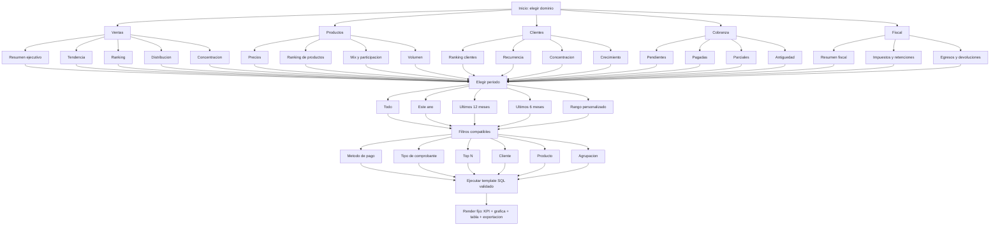

# Asistente Guiado: Arbol de Decision y Catalogo Base

## Objetivo

Reducir ambiguedad y riesgo operativo reemplazando el flujo de lenguaje natural por un catalogo finito de consultas guiadas, parametrizadas y validadas.

Principios de diseno:

- Maximo 20 casos productivos iniciales.
- Sin interpretacion libre de texto.
- Solo opciones validas por dominio.
- Periodos guiados y consistentes.
- SQL predefinido por template, no generado por IA.
- Reglas de tenant, periodo y perfil aplicadas de forma deterministica.

## Arbol de decision

## Estructura de navegacion sugerida

1. Dominio
2. Analisis
3. Periodo
4. Filtros opcionales
5. Resultado

## Dominios y 20 casos cerrados

### Ventas

1. Resumen ejecutivo de ventas
2. Ventas por mes
3. Top clientes por ventas
4. Top productos por ventas
5. Concentracion de clientes

### Productos

6. Estadisticas de precios unitarios
7. Top productos por facturacion
8. Productos de menor venta
9. Participacion por producto

### Clientes

10. Ranking de clientes
11. Clientes recurrentes
12. Clientes nuevos por periodo
13. Crecimiento por cliente

### Cobranza

14. Facturas pendientes de cobro
15. Facturas pagadas
16. Facturas parcialmente pagadas
17. Antiguedad de cartera

### Fiscal

18. Resumen fiscal de ingresos
19. Impuestos trasladados y retenidos
20. Egresos y notas de credito

## Parametros comunes

- period_mode: todo | este_ano | ultimos_12_meses | ultimos_6_meses | rango_personalizado
- start_date
- end_date
- top_n
- metodo_pago
- tipo_comprobante
- cliente
- producto
- agrupacion: mensual | trimestral | anual | total

## Reglas de validacion de UX

- El usuario nunca escribe la consulta.
- Si una opcion no aplica al dominio, no se muestra.
- Si una opcion requiere serie temporal, se fuerza agrupacion temporal valida.
- Si una opcion requiere volumen minimo, se muestra aviso de insuficiencia de datos.
- Si una opcion depende de datos no implementados, no se incluye en el catalogo inicial.

## Reglas de validacion tecnica

- Cada caso tiene un template SQL unico.
- Cada caso define tablas permitidas.
- Cada caso define filtros compatibles.
- Los filtros de tenant y periodo se insertan en puntos explicitamente definidos por template.
- Cada caso define grafica por defecto y fallback a tabla.

## Recomendacion de implementacion

Fase 1:

- Implementar el catalogo JSON.
- Construir selector de dominio -> analisis -> periodo -> filtros.
- Resolver template SQL por id.
- Reusar render actual de KPIs, tablas, graficas y exportacion.

Fase 2:

- Agregar disponibilidad condicional por perfil.
- Agregar textos ejecutivos predefinidos por caso.
- Agregar tracking de uso por opcion.
