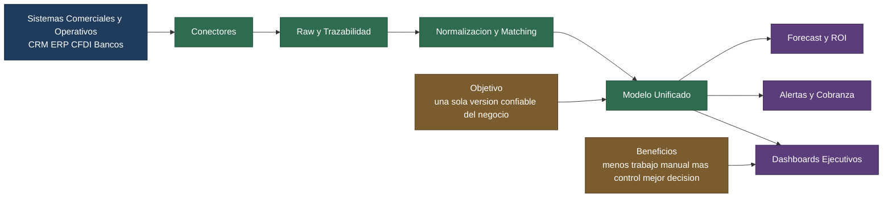

# Diagrama Ejecutivo de Integracion CRM ERP

## Objetivo

Mostrar en una sola pagina la historia ejecutiva de la integracion futura: de donde vienen los datos, como se consolidan y que valor entregan al negocio.

## Vista Ejecutiva

## Vista SVG Renderizada

## Lectura de Negocio

1. Los datos no entran directo al dashboard; pasan primero por una capa controlada de integracion.
2. La trazabilidad raw evita perder contexto y permite auditar cualquier cifra publicada.
3. La normalizacion y el matching convierten multiples sistemas en una sola version confiable del cliente, producto, vendedor, factura y pago.
4. El modelo unificado habilita analitica transversal: ventas, pipeline, cobranza, cartera, forecast y ROI.
5. El resultado final es menos trabajo manual, mas consistencia y mejor velocidad de decision.

## Archivos Exportados

Los renders exportados de este diagrama deben vivir en:

- docs/assets/diagrams/diagrama_ejecutivo_integracion_crm_erp.svg
- docs/assets/diagrams/diagrama_ejecutivo_integracion_crm_erp.png