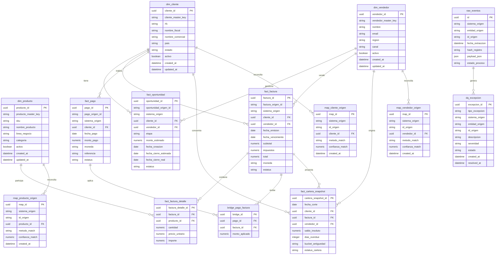

# Modelo Fisico de Integracion CRM ERP

## Objetivo

Traducir la arquitectura de integracion CRM ERP a un modelo fisico implementable, con tablas sugeridas, relaciones clave y flujo de publicacion hacia la capa analitica.

Este documento asume una estrategia por capas:

1. Raw
2. Normalizado canonico
3. Matching y reconciliacion
4. Data marts analiticos

## Diagrama Fisico Simplificado

## Vista SVG Renderizada

## Archivos Exportados

- SVG: `docs/assets/diagrams/modelo_fisico_integracion_crm_erp.svg`
- PNG: `docs/assets/diagrams/modelo_fisico_integracion_crm_erp.png`

## Capas Recomendadas

### 1. Capa Raw

Tabla minima:

- `raw_eventos`

Uso:

- conservar el payload original
- soportar replay
- auditar cambios del sistema fuente
- comparar registros entre corridas

Reglas:

1. Nunca sobrescribir sin versionar o sin hash.
2. Guardar siempre sistema, entidad e id_origen.
3. Permitir almacenar payload JSON completo.

### 2. Dimensiones Canonicas

Tablas sugeridas:

- `dim_cliente`
- `dim_vendedor`
- `dim_producto`

Estas tablas representan identidades maestras internas, independientes del identificador de cada CRM o ERP.

### 3. Hechos Operativos

Tablas sugeridas:

- `fact_oportunidad`
- `fact_factura`
- `fact_factura_detalle`
- `fact_pago`
- `bridge_pago_factura`
- `fact_cartera_snapshot`

Puntos importantes:

1. `fact_factura` representa la transaccion emitida.
2. `fact_pago` representa el pago recibido.
3. `bridge_pago_factura` resuelve la aplicacion parcial o multiple de pagos.
4. `fact_cartera_snapshot` permite foto diaria o por corte de la cartera, que es la base mas solida para CxC y aging.

### 4. Mapas de Reconciliacion

Tablas sugeridas:

- `map_cliente_origen`
- `map_vendedor_origen`
- `map_producto_origen`

Estas tablas son claves para no contaminar las dimensiones con multiples ids de origen.

Campos recomendados:

- `sistema_origen`
- `id_origen`
- `metodo_match`
- `confianza_match`

Con esto puedes distinguir:

- match exacto
- match por RFC
- match por nombre normalizado
- match manual

### 5. Calidad de Datos y Excepciones

Tabla sugerida:

- `dq_excepcion`

Debe registrar errores operativos como:

- cliente sin match
- pago sin factura
- factura sin vendedor
- producto huérfano
- moneda o tipo de cambio faltante

## Data Marts Recomendados

Encima del modelo fisico operativo, yo construiria vistas o tablas derivadas para consumo analitico.

### `mart_pipeline_comercial`

Campos sugeridos:

- fecha
- vendedor_id
- cliente_id
- etapa
- monto_estimado
- probabilidad
- monto_ponderado

### `mart_ventas`

Campos sugeridos:

- fecha_emision
- vendedor_id
- cliente_id
- producto_id
- linea_negocio
- total_usd
- total_mxn

### `mart_cobranza`

Campos sugeridos:

- fecha_pago
- cliente_id
- vendedor_id
- monto_aplicado
- factura_id

### `mart_cartera`

Campos sugeridos:

- fecha_corte
- cliente_id
- vendedor_id
- saldo_insoluto
- dias_overdue
- bucket_antiguedad
- cartera_vigente
- cartera_vencida
- cartera_critica

### `mart_ytd`

Campos sugeridos:

- fecha_corte
- anio
- dimension_analitica
- valor_ytd
- valor_ytd_anterior
- crecimiento_pct

## Reglas de Modelado

### Clientes

La entidad cliente debe ser maestra y unica. No conviene usar directamente el id del CRM o ERP como PK del negocio.

### Facturas y Pagos

No asumir relacion uno a uno.

Casos reales:

- un pago liquida varias facturas
- una factura se liquida con varios pagos
- hay pagos parciales

Por eso la tabla `bridge_pago_factura` es obligatoria si quieres cartera y cobranza confiables.

### Cartera

Para analitica de CxC, una tabla snapshot por fecha de corte es mas util que recalcular todo en tiempo real desde facturas y pagos cada vez.

Ventajas:

1. mejor performance
2. trazabilidad historica
3. comparativos YTD y aging consistentes

## Flujo Recomendado de Publicacion

1. Ingestar a `raw_eventos`.
2. Validar estructura minima.
3. Normalizar a staging canonico.
4. Resolver matches hacia dimensiones maestras.
5. Publicar hechos operativos.
6. Generar snapshots de cartera.
7. Materializar marts analiticos.
8. Consumir desde dashboards y alertas.

## Recomendaciones de Implementacion

### Indices

Prioridad alta en:

- `raw_eventos(sistema_origen, entidad_origen, id_origen)`
- `fact_factura(cliente_id, fecha_emision)`
- `fact_pago(cliente_id, fecha_pago)`
- `fact_cartera_snapshot(fecha_corte, vendedor_id)`
- `map_cliente_origen(sistema_origen, id_origen)`

### Claves de Negocio

Mantener siempre una `master_key` por dimension para evitar dependencia de ids externos.

### Trazabilidad

Cada registro analitico critico debe poder rastrearse hasta:

- sistema origen
- id de origen
- fecha de extraccion
- regla de matching aplicada

## Conclusión

Este modelo fisico separa bien origen, identidad maestra, hechos operativos y consumo analitico. Eso permite crecer a multiples CRMs y ERPs sin meter caos directamente en los dashboards.

La mejor inversion aqui no es el conector. Es la capa de reconciliacion y el modelo de snapshots de cartera.